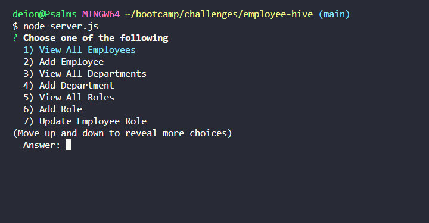

# employee-hive

[Link to my project](https://github.com/Deiontre10/employee-hive)
[Link to demo video]()

## Table of Contents
- [Description](#description)
- [Visuals](#visuals)

## Description
Employee Hive is a powerful departmental management system utilizing MySQL and node that lets you view all departments, add departments, view all roles, add roles, view all employees, add new employees and update employee roles.

## Visuals

